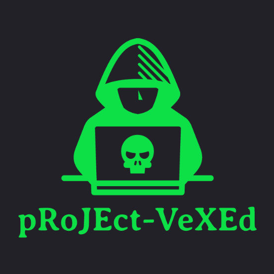

<h1 align="center">lı★ıl PⒶLⓄ — BLZ Corp.</h1>

<a href="https://pages.github.com">GitHub Page</a> basada en el tema per a <a href="https://jekyllrb.com">Jekyll</a> de <a href="https://github.com/akiritsu">DeerRIDER</a>:

  

Fes click a la imatge per accedir a la pàgina del projecte original i a la seva <a href="https://github.com/akiritsu/pRoJEct-VeXEd/blob/master/README.md">documentació</a>.

<h3 align="center">Llicència</h3>

Distribuït sota llicència MIT.

[![MIT License][license-shield]][license-url]

[license-shield]: https://img.shields.io/github/license/akiritsu/pRoJEct-VeXEd.svg?style=flat-square
[license-url]: https://github.com/akiritsu/pRoJEct-VeXEd/blob/master/LICENSE
